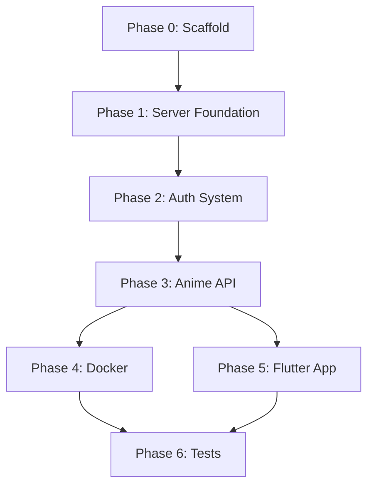

# AnimeSync Implementation Plan

> **For Hermes:** Use subagent-driven-development skill to implement this plan task-by-task.

**Goal:** Build a complete anime tracking sync system with FastAPI backend + Android app (Flutter) + Docker deployment.

**Architecture:**
- **Server:** FastAPI + SQLAlchemy 2.0 + Alembic — supports SQLite (dev) / MySQL / PostgreSQL (prod). JWT auth with refresh token rotation, rate limiting, bcrypt password hashing. User-isolated data. Bangumi API integration.
- **Client:** Cross-platform Flutter app (Android first). Drift (SQLite) for offline cache. Dio for HTTP. Provider for state management.
- **Deployment:** Docker Compose with nginx reverse proxy, PostgreSQL, and FastAPI app.

**Tech Stack:**
- Backend: Python 3.11+, FastAPI, SQLAlchemy 2.0, Alembic, Pydantic v2, PyJWT, passlib[bcrypt], slowapi
- Database: SQLite (dev), asyncpg/psycopg2 (prod PostgreSQL), PyMySQL (MySQL)
- Client: Flutter 3.x, Dart, drift, dio, flutter_secure_storage, provider
- Infra: Docker, Docker Compose, nginx

---

## 🚨 项目约束 (Must Follow)

三条硬性约束，所有代码实现必须遵守：

### 约束 1: 代码精简复用
- 不重复自己。相同逻辑提取成函数/类，禁止 copy-paste
- API 响应统一格式：`{"code": 200, "message": "ok", "data": ...}`
- 统一异常处理，不每个路由写 try/except
- 相同模式的 CRUD 操作用基类或辅助函数
- 能用依赖注入(Dependency Injection)的绝不重复写

### 约束 2: 配置文件统一为 JSON，统一管理
- 所有配置（DB连接、JWT密钥、限流、日志级别等）存在 `server/config.json`
- 不允许环境变量、`.env`、硬编码路径等多源头配置
- 不允许各模块自己读 config.json
- 用 `config_loader.py` 单例统一加载并缓存 (`@lru_cache` / 模块级变量)
- 其他模块通过函数调用获取配置，不直接读文件
- Docker 部署时通过 volume 挂载外部 config.json 覆盖

### 约束 3: 日志配置统一
- 日志格式、级别、输出目标统一在 `server/config.json` 中配置
- 用 `logging_config.py` 单例初始化 logger
- 所有模块通过 `logger = get_logger(__name__)` 获取
- 统一格式: `[YYYY-MM-DD HH:MM:SS] [LEVEL] [module_name] message`
- 支持文件输出 + 控制台输出

---

## Phase 0: Project Scaffolding

### Task 0.1: Create project directory structure

**Objective:** Establish clean monorepo layout

**Files:**
- Create: `animesync/` (root)
- Create: `animesync/server/` (backend)
- Create: `animesync/client/` (flutter app)
- Create: `animesync/docker/`
- Create: `animesync/docs/`

**Step 1: Create directories**

```bash
mkdir -p animesync/{server/{app/{api,core,models,schemas,services},alembic/versions,tests},client,docker,nginx}
cd animesync
```

**Step 2: Verify**

```bash
find . -type d | sort
```
Expected: all directories listed.

**Step 3: Commit**

```bash
git init
git add -A
git commit -m "chore: initialize animesync project structure"
```

---

## Phase 1: Server Foundation

### Task 1.1: Server dependencies and config.json + config_loader + logging_config

**Objective:** Set up Python dependencies with `requirements.txt`, `config.json` for unified configuration, `config_loader.py` as single source of truth, and `logging_config.py` for unified logging.

**Files:**
- Create: `server/requirements.txt`
- Create: `server/config.json`
- Create: `server/config.json.example`
- Create: `server/.gitignore`
- Create: `server/app/__init__.py` (empty)
- Create: `server/app/main.py` (fastapi app)
- Create: `server/app/core/__init__.py` (empty)
- Create: `server/app/core/config_loader.py`
- Create: `server/app/core/logging_config.py`

**Step 1: Create requirements.txt**

```txt
fastapi>=0.110.0
uvicorn[standard]>=0.29.0
sqlalchemy>=2.0.30
alembic>=1.13.0
pydantic>=2.7.0
pyjwt>=2.8.0
passlib[bcrypt]>=1.7.4
python-multipart>=0.0.9
slowapi>=0.1.9
httpx>=0.27.0
aiosqlite>=0.20.0
asyncpg>=0.29.0
pymysql>=1.1.0
cryptography>=42.0.0
pydantic-settings>=2.3.0
```

**Step 2: Create config.json**

```json
{
  "server": {
    "host": "0.0.0.0",
    "port": 8000,
    "cors_origins": "*",
    "debug": false
  },
  "database": {
    "url": "sqlite+aiosqlite:///./animesync.db",
    "echo_sql": false,
    "pool_size": 5,
    "max_overflow": 10
  },
  "jwt": {
    "secret_key": "change-me-to-a-random-secret-at-least-32-chars",
    "algorithm": "HS256",
    "access_token_expire_minutes": 15,
    "refresh_token_expire_days": 7
  },
  "security": {
    "max_login_attempts": 5,
    "login_lockout_minutes": 15,
    "min_password_length": 8
  },
  "rate_limit": {
    "per_minute": 100
  },
  "logging": {
    "level": "INFO",
    "format": "[%(asctime)s] [%(levelname)s] [%(name)s] %(message)s",
    "date_format": "%Y-%m-%d %H:%M:%S",
    "file_output": {
      "enabled": false,
      "path": "logs/animesync.log",
      "max_bytes": 10485760,
      "backup_count": 5
    },
    "console_output": {
      "enabled": true
    }
  }
}
```

**Step 3: Create config.json.example**

Copy of config.json but with `change-me-*` placeholders filled with instructions.

**Step 4: Create config_loader.py** — centralized config loading with caching

```python
"""Configuration loader — single source of truth for all settings.

CONSTRAINT: All config is loaded from config.json ONLY.
No other files (env, yaml, etc.) are allowed as config sources.
All modules must call get_config() to access settings.
"""

import json
import os
from functools import lru_cache
from typing import Any


DEFAULT_CONFIG_PATH = os.path.join(os.path.dirname(os.path.dirname(__file__)), "config.json")


class ConfigError(Exception):
    """Raised when configuration cannot be loaded or validated."""
    pass


@lru_cache(maxsize=1)
def _load_raw(path: str) -> dict:
    """Load and cache config.json content. Cached for entire process lifetime."""
    if not os.path.exists(path):
        raise ConfigError(f"Configuration file not found: {path}")
    try:
        with open(path, "r", encoding="utf-8") as f:
            return json.load(f)
    except json.JSONDecodeError as e:
        raise ConfigError(f"Invalid JSON in config file: {e}")
    except IOError as e:
        raise ConfigError(f"Cannot read config file: {e}")


def get_config(path: str | None = None) -> dict:
    """Get the full configuration dict.

    All modules call this. Never read config.json directly.
    """
    config_path = path or os.environ.get("ANIMESYNC_CONFIG") or DEFAULT_CONFIG_PATH
    return _load_raw(config_path)


def get_database_config() -> dict:
    """Get database section of config."""
    return get_config().get("database", {})


def get_jwt_config() -> dict:
    """Get JWT section of config."""
    return get_config().get("jwt", {})


def get_security_config() -> dict:
    """Get security section of config."""
    return get_config().get("security", {})


def get_server_config() -> dict:
    """Get server section of config."""
    return get_config().get("server", {})


def get_rate_limit_config() -> dict:
    """Get rate limit section of config."""
    return get_config().get("rate_limit", {})


def get_logging_config() -> dict:
    """Get logging section of config."""
    return get_config().get("logging", {})


def reload_config(path: str | None = None) -> dict:
    """Force reload config (clear cache). Use only in dev/testing."""
    _load_raw.cache_clear()
    return get_config(path)
```

**Step 5: Create logging_config.py** — unified logging setup

```python
"""Logging configuration — single entry point for all loggers.

CONSTRAINT: Logging settings come from config.json > logging section.
All modules get loggers via get_logger(__name__).
"""

import logging
import logging.handlers
import os
import sys
from typing import Dict

from app.core.config_loader import get_logging_config


_loggers: Dict[str, logging.Logger] = {}
_initialized = False


def setup_logging(config_override: dict | None = None) -> None:
    """Initialize logging system once. Called at app startup."""
    global _initialized
    if _initialized:
        return

    log_config = config_override or get_logging_config()

    # Get root logger
    root_logger = logging.getLogger()
    root_logger.setLevel(log_config.get("level", "INFO").upper())

    # Remove existing handlers to avoid duplicates on reload
    root_logger.handlers.clear()

    # Formatter
    fmt = log_config.get("format",
                         "[%(asctime)s] [%(levelname)s] [%(name)s] %(message)s")
    datefmt = log_config.get("date_format", "%Y-%m-%d %H:%M:%S")
    formatter = logging.Formatter(fmt, datefmt)

    # Console output
    console_cfg = log_config.get("console_output", {"enabled": True})
    if console_cfg.get("enabled", True):
        console_handler = logging.StreamHandler(sys.stdout)
        console_handler.setFormatter(formatter)
        root_logger.addHandler(console_handler)

    # File output
    file_cfg = log_config.get("file_output", {"enabled": False})
    if file_cfg.get("enabled", False):
        log_path = file_cfg.get("path", "logs/animesync.log")
        log_dir = os.path.dirname(log_path)
        if log_dir:
            os.makedirs(log_dir, exist_ok=True)
        file_handler = logging.handlers.RotatingFileHandler(
            log_path,
            maxBytes=file_cfg.get("max_bytes", 10 * 1024 * 1024),
            backupCount=file_cfg.get("backup_count", 5),
        )
        file_handler.setFormatter(formatter)
        root_logger.addHandler(file_handler)

    # Silence noisy third-party loggers in production
    if log_config.get("level", "INFO").upper() == "INFO":
        logging.getLogger("httpx").setLevel(logging.WARNING)
        logging.getLogger("httpcore").setLevel(logging.WARNING)
        logging.getLogger("sqlalchemy.engine").setLevel(logging.WARNING)

    _initialized = True
    logging.getLogger(__name__).info("Logging system initialized")


def get_logger(name: str) -> logging.Logger:
    """Get a logger for a module. Use this everywhere instead of logging.getLogger directly."""
    if name in _loggers:
        return _loggers[name]
    logger = logging.getLogger(name)
    _loggers[name] = logger
    return logger
```

**Step 6: Create main.py** — with config_loader and logging

```python
"""AnimeSync API Server — entry point"""

from contextlib import asynccontextmanager
from fastapi import FastAPI
from fastapi.middleware.cors import CORSMiddleware
from slowapi import _rate_limit_exceeded_handler
from slowapi.errors import RateLimitExceeded
from app.core.config_loader import get_server_config, get_rate_limit_config, ConfigError
from app.core.logging_config import setup_logging, get_logger
from app.core.limiter import limiter


@asynccontextmanager
async def lifespan(app: FastAPI):
    """Application lifecycle"""
    logger = get_logger("animesync")
    logger.info("AnimeSync server starting...")
    yield
    logger.info("AnimeSync server shutting down...")


def create_app() -> FastAPI:
    # Initialize logging FIRST
    setup_logging()

    logger = get_logger("animesync")

    try:
        server_cfg = get_server_config()
    except ConfigError as e:
        logger.error(str(e))
        raise

    app = FastAPI(
        title="AnimeSync API",
        version="0.1.0",
        lifespan=lifespan,
    )

    # CORS
    app.add_middleware(
        CORSMiddleware,
        allow_origins=server_cfg.get("cors_origins", "*"),
        allow_credentials=True,
        allow_methods=["*"],
        allow_headers=["*"],
    )

    # Rate limiter
    app.state.limiter = limiter
    app.add_exception_handler(RateLimitExceeded, _rate_limit_exceeded_handler)

    # Health check
    @app.get("/")
    async def root():
        return {"code": 200, "message": "ok", "data": {"service": "AnimeSync", "version": "0.1.0"}}

    @app.get("/health")
    async def health():
        return {"code": 200, "message": "ok", "data": {"status": "healthy"}}

    return app


app = create_app()
```

**Step 7: Create limiter.py**

```python
"""Rate limiter — reads config from config_loader"""

from slowapi import Limiter
from slowapi.util import get_remote_address
from app.core.config_loader import get_rate_limit_config

rate_cfg = get_rate_limit_config()
limiter = Limiter(
    key_func=get_remote_address,
    default_limits=[f"{rate_cfg.get('per_minute', 100)}/minute"],
)
```

**Step 8: Verify**

```bash
cd /home/void/prj/animesync/server
python3 -c "
from app.core.config_loader import get_config, get_database_config
from app.core.logging_config import setup_logging, get_logger
cfg = get_config()
print('Database URL:', cfg['database']['url'])
print('JWT algo:', cfg['jwt']['algorithm'])
setup_logging()
log = get_logger('test')
log.info('Logging works!')
"
```
Expected:
```
Database URL: sqlite+aiosqlite:///./animesync.db
JWT algo: HS256
[2026-05-05 21:00:00] [INFO] [test] Logging works!
```

**Step 9: Commit**

```bash
git add server/requirements.txt server/config.json server/config.json.example server/.gitignore
git add server/app/__init__.py server/app/main.py server/app/core/
git commit -m "feat(server): add config.json + config_loader + logging_config"
```

---

### Task 1.2: Database models and connection

---

### Task 1.2: Database models and connection

**Objective:** Set up SQLAlchemy async engine, session factory, and all data models.

**Files:**
- Create: `server/app/core/database.py`
- Create: `server/app/models/__init__.py`
- Create: `server/app/models/user.py`
- Create: `server/app/models/anime.py`

**Step 1: Create database.py**

```python
"""Async SQLAlchemy engine and session management — reads config from config_loader"""

from sqlalchemy.ext.asyncio import AsyncSession, create_async_engine, async_sessionmaker
from sqlalchemy.orm import DeclarativeBase
from app.core.config_loader import get_database_config


class Base(DeclarativeBase):
    pass


_engine = None
_async_session_maker = None


def get_engine():
    global _engine
    if _engine is None:
        db_cfg = get_database_config()
        _engine = create_async_engine(
            db_cfg["url"],
            echo=db_cfg.get("echo_sql", False),
            pool_size=db_cfg.get("pool_size", 5),
            max_overflow=db_cfg.get("max_overflow", 10),
        )
    return _engine


def get_session_maker():
    global _async_session_maker
    if _async_session_maker is None:
        engine = get_engine()
        _async_session_maker = async_sessionmaker(engine, class_=AsyncSession, expire_on_commit=False)
    return _async_session_maker


async def get_session() -> AsyncSession:
    """Dependency that provides a database session"""
    session_maker = get_session_maker()
    async with session_maker() as session:
        try:
            yield session
            await session.commit()
        except Exception:
            await session.rollback()
            raise
        finally:
            await session.close()
```

**Step 2: Create User model**

```python
"""User model"""

import uuid
from datetime import datetime
from sqlalchemy import String, DateTime, Integer, Boolean, func
from sqlalchemy.orm import Mapped, mapped_column, relationship
from app.core.database import Base


class User(Base):
    __tablename__ = "users"

    id: Mapped[str] = mapped_column(String(36), primary_key=True, default=lambda: str(uuid.uuid4()))
    username: Mapped[str] = mapped_column(String(50), unique=True, nullable=False, index=True)
    password_hash: Mapped[str] = mapped_column(String(128), nullable=False)
    created_at: Mapped[datetime] = mapped_column(DateTime(timezone=True), server_default=func.now())
    updated_at: Mapped[datetime] = mapped_column(DateTime(timezone=True), server_default=func.now(), onupdate=func.now())
    is_active: Mapped[bool] = mapped_column(Boolean, default=True)

    # Security fields
    failed_login_attempts: Mapped[int] = mapped_column(Integer, default=0)
    locked_until: Mapped[datetime | None] = mapped_column(DateTime(timezone=True), nullable=True)

    # Relations
    anime_list = relationship("AnimeEntry", back_populates="user", cascade="all, delete-orphan")

    def __repr__(self):
        return f"<User {self.username}>"
```

**Step 3: Create Anime model**

```python
"""Anime entry model"""

import uuid
from datetime import datetime
from sqlalchemy import String, Integer, Float, Text, DateTime, ForeignKey, func, Enum as SAEnum
from sqlalchemy.orm import Mapped, mapped_column, relationship
from app.core.database import Base
import enum


class WatchStatus(str, enum.Enum):
    WATCHING = "watching"       # 追番中
    COMPLETED = "completed"     # 已完结
    ON_HOLD = "on_hold"        # 搁置
    DROPPED = "dropped"        # 弃番
    PLAN_TO_WATCH = "plan_to_watch"  # 想看


class AnimeEntry(Base):
    __tablename__ = "anime_entries"

    id: Mapped[str] = mapped_column(String(36), primary_key=True, default=lambda: str(uuid.uuid4()))
    user_id: Mapped[str] = mapped_column(String(36), ForeignKey("users.id"), nullable=False, index=True)
    title: Mapped[str] = mapped_column(String(200), nullable=False)
    title_cn: Mapped[str | None] = mapped_column(String(200), nullable=True)  # 中文标题
    cover_url: Mapped[str | None] = mapped_column(String(500), nullable=True)
    total_episodes: Mapped[int] = mapped_column(Integer, default=0)
    watched_episodes: Mapped[int] = mapped_column(Integer, default=0)
    status: Mapped[WatchStatus] = mapped_column(SAEnum(WatchStatus), default=WatchStatus.WATCHING)
    rating: Mapped[float | None] = mapped_column(Float, nullable=True)  # 1-10
    notes: Mapped[str | None] = mapped_column(Text, nullable=True)
    bangumi_id: Mapped[int | None] = mapped_column(Integer, nullable=True)  # Bangumi ID
    created_at: Mapped[datetime] = mapped_column(DateTime(timezone=True), server_default=func.now())
    updated_at: Mapped[datetime] = mapped_column(DateTime(timezone=True), server_default=func.now(), onupdate=func.now())
    is_deleted: Mapped[bool] = mapped_column(default=False)  # Soft delete

    # Relations
    user = relationship("User", back_populates="anime_list")

    def __repr__(self):
        return f"<AnimeEntry {self.title} ({self.watched_episodes}/{self.total_episodes})>"
```

**Step 4: Verify models import correctly**

```bash
cd /home/void/prj/animesync/server
python3 -c "
from app.core.database import Base
from app.models.user import User
from app.models.anime import AnimeEntry
print('Models loaded:', User.__tablename__, AnimeEntry.__tablename__)
"
```
Expected: `Models loaded: users anime_entries`

**Step 5: Commit**

```bash
git add server/app/core/database.py server/app/models/
git commit -m "feat(server): add database models (User, AnimeEntry) with async SQLAlchemy"
```

---

### Task 1.3: Alembic migrations setup

**Objective:** Configure Alembic for database migrations.

**Files:**
- Create: `server/alembic.ini`
- Create: `server/alembic/env.py`
- Create: `server/alembic/script.py.mako`

**Step 1: Generate Alembic config**

```bash
cd /home/void/prj/animesync/server
pip install alembic 2>&1 | tail -3
alembic init alembic
```

**Step 2: Edit alembic.ini** — set sqlalchemy.url to placeholder:
```ini
sqlalchemy.url = sqlite+aiosqlite:///./animesync.db
```

**Step 3: Edit alembic/env.py** for async support + config_loader integration:

```python
import asyncio
from logging.config import fileConfig
from sqlalchemy import pool
from sqlalchemy.engine import Connection
from sqlalchemy.ext.asyncio import async_engine_from_config
from alembic import context
import sys
import os

# Add server directory to path so app imports work
sys.path.insert(0, os.path.dirname(os.path.dirname(__file__)))

from app.core.database import Base
from app.core.config_loader import get_database_config
from app.models.user import User  # noqa: F401
from app.models.anime import AnimeEntry  # noqa: F401

config = context.config
if config.config_file_name is not None:
    fileConfig(config.config_file_name)
target_metadata = Base.metadata


def run_migrations_offline():
    db_cfg = get_database_config()
    url = db_cfg["url"]
    context.configure(url=url, target_metadata=target_metadata, literal_binds=True,
                      dialect_opts={"paramstyle": "named"})
    with context.begin_transaction():
        context.run_migrations()


def do_run_migrations(connection: Connection):
    context.configure(connection=connection, target_metadata=target_metadata)
    with context.begin_transaction():
        context.run_migrations()


async def run_async_migrations():
    db_cfg = get_database_config()
    config.set_main_option("sqlalchemy.url", db_cfg["url"])
    connectable = async_engine_from_config(
        config.get_section(config.config_ini_section, {}),
        prefix="sqlalchemy.",
        poolclass=pool.NullPool,
    )
    async with connectable.connect() as connection:
        await connection.run_sync(do_run_migrations)
    await connectable.dispose()


def run_migrations_online():
    asyncio.run(run_async_migrations())


if context.is_offline_mode():
    run_migrations_offline()
else:
    run_migrations_online()
```

**Step 4: Create initial migration**

```bash
cd /home/void/prj/animesync/server
alembic revision --autogenerate -m "initial migration"
```

Expected output: `Generating alembic/versions/XXX_initial_migration.py`

**Step 5: Apply migration**

```bash
alembic upgrade head
```

Expected output: `INFO  [alembic.runtime.migration] Running upgrade -> XXX, initial migration`

**Step 6: Verify tables exist**

```bash
sqlite3 animesync.db ".tables"
```
Expected: `alembic_version  anime_entries    users`

**Step 7: Commit**

```bash
git add server/alembic.ini server/alembic/
git commit -m "feat(server): configure alembic with initial migration"
```

---

## Phase 2: Server — Auth System

### Task 2.1: Password hashing and JWT utilities

**Objective:** Implement password hashing (bcrypt) and JWT token generation/verification.

**Files:**
- Create: `server/app/services/__init__.py` (empty)
- Create: `server/app/services/security.py`

**Step 1: Write security.py**

```python
"""Password hashing and JWT utilities — reads config from config_loader"""

from datetime import datetime, timedelta, timezone
from passlib.context import CryptContext
from jose import jwt, JWTError
from app.core.config_loader import get_jwt_config, get_security_config

pwd_context = CryptContext(schemes=["bcrypt"], deprecated="auto")


def hash_password(password: str) -> str:
    return pwd_context.hash(password)


def verify_password(plain_password: str, hashed_password: str) -> bool:
    return pwd_context.verify(plain_password, hashed_password)


def validate_password_strength(password: str) -> tuple[bool, str]:
    """Validate password meets minimum requirements from config"""
    sec_cfg = get_security_config()
    min_len = sec_cfg.get("min_password_length", 8)
    if len(password) < min_len:
        return False, f"Password must be at least {min_len} characters"
    if not any(c.isupper() for c in password):
        return False, "Password must contain at least one uppercase letter"
    if not any(c.islower() for c in password):
        return False, "Password must contain at least one lowercase letter"
    if not any(c.isdigit() for c in password):
        return False, "Password must contain at least one digit"
    return True, ""


def create_access_token(user_id: str) -> str:
    jwt_cfg = get_jwt_config()
    expire = datetime.now(timezone.utc) + timedelta(minutes=jwt_cfg.get("access_token_expire_minutes", 15))
    payload = {"sub": user_id, "type": "access", "exp": expire}
    return jwt.encode(payload, jwt_cfg["secret_key"], algorithm=jwt_cfg.get("algorithm", "HS256"))


def create_refresh_token(user_id: str) -> str:
    jwt_cfg = get_jwt_config()
    expire = datetime.now(timezone.utc) + timedelta(days=jwt_cfg.get("refresh_token_expire_days", 7))
    payload = {"sub": user_id, "type": "refresh", "exp": expire}
    return jwt.encode(payload, jwt_cfg["secret_key"], algorithm=jwt_cfg.get("algorithm", "HS256"))


def decode_token(token: str) -> dict | None:
    """Decode and validate a JWT token. Returns payload or None."""
    jwt_cfg = get_jwt_config()
    try:
        payload = jwt.decode(token, jwt_cfg["secret_key"], algorithms=[jwt_cfg.get("algorithm", "HS256")])
        return payload
    except JWTError:
        return None
```

**Step 2: Verify**

```bash
cd /home/void/prj/animesync/server
python3 -c "
from app.services.security import hash_password, verify_password, validate_password_strength
h = hash_password('Test1234')
assert verify_password('Test1234', h)
assert not verify_password('Test1234', 'wrong')
valid, msg = validate_password_strength('Test1234')
print('Strong pw:', valid)
valid2, msg2 = validate_password_strength('weak')
print('Weak pw:', valid2, msg2)
print('All security checks passed!')
"
```
Expected: `Strong pw: True` `Weak pw: False Password must be at least 8 characters`

**Step 3: Commit**

```bash
git add server/app/services/
git commit -m "feat(server): add password hashing and JWT token utilities"
```

---

### Task 2.2: Auth dependency (JWT bearer extractor)

**Objective:** Create FastAPI dependency that extracts and validates JWT from `Authorization` header.

**Files:**
- Create: `server/app/api/__init__.py` (empty)
- Create: `server/app/api/deps.py`

**Step 1: Write deps.py**

```python
"""FastAPI dependencies — JWT auth extractor"""

from fastapi import Depends, HTTPException, status
from fastapi.security import HTTPBearer, HTTPAuthorizationCredentials
from sqlalchemy.ext.asyncio import AsyncSession
from sqlalchemy import select
from app.core.database import get_session
from app.services.security import decode_token
from app.models.user import User

bearer_scheme = HTTPBearer(auto_error=False)


async def get_current_user(
    credentials: HTTPAuthorizationCredentials = Depends(bearer_scheme),
    session: AsyncSession = Depends(get_session),
) -> User:
    """Extract and validate current user from JWT access token"""
    if credentials is None:
        raise HTTPException(
            status_code=status.HTTP_401_UNAUTHORIZED,
            detail="Not authenticated",
            headers={"WWW-Authenticate": "Bearer"},
        )

    payload = decode_token(credentials.credentials)
    if payload is None or payload.get("type") != "access":
        raise HTTPException(
            status_code=status.HTTP_401_UNAUTHORIZED,
            detail="Invalid or expired token",
            headers={"WWW-Authenticate": "Bearer"},
        )

    user_id = payload.get("sub")
    if user_id is None:
        raise HTTPException(status_code=status.HTTP_401_UNAUTHORIZED, detail="Invalid token")

    result = await session.execute(select(User).where(User.id == user_id, User.is_active == True))
    user = result.scalar_one_or_none()
    if user is None:
        raise HTTPException(status_code=status.HTTP_401_UNAUTHORIZED, detail="User not found or inactive")

    # Check if user is locked out
    if user.locked_until and user.locked_until > datetime.now(timezone.utc):
        raise HTTPException(status_code=status.HTTP_403_FORBIDDEN, detail="Account is temporarily locked")

    return user
```

**Step 2: Verify**

```python
python3 -c "
from app.api.deps import get_current_user, bearer_scheme
print('Auth deps loaded:', type(bearer_scheme).__name__)
"
```
Expected: `Auth deps loaded: HTTPBearer`

**Step 3: Commit**

```bash
git add server/app/api/deps.py
git commit -m "feat(server): add JWT auth dependency for protected routes"
```

---

### Task 2.3: Auth API — schemas

**Objective:** Pydantic request/response schemas for auth endpoints.

**Files:**
- Create: `server/app/schemas/__init__.py`
- Create: `server/app/schemas/auth.py`

**Step 1: Write auth.py**

```python
"""Auth schemas"""

from pydantic import BaseModel, field_validator
import re


class RegisterRequest(BaseModel):
    username: str
    password: str

    @field_validator("username")
    @classmethod
    def validate_username(cls, v: str) -> str:
        v = v.strip()
        if len(v) < 3 or len(v) > 30:
            raise ValueError("Username must be 3-30 characters")
        if not re.match(r"^[a-zA-Z0-9_]+$", v):
            raise ValueError("Username can only contain letters, numbers, and underscores")
        return v


class LoginRequest(BaseModel):
    username: str
    password: str


class TokenResponse(BaseModel):
    access_token: str
    refresh_token: str
    token_type: str = "bearer"


class RefreshRequest(BaseModel):
    refresh_token: str


class MessageResponse(BaseModel):
    message: str
```

**Step 2: Verify**

```bash
python3 -c "
from app.schemas.auth import RegisterRequest, TokenResponse
r = RegisterRequest(username='test_user', password='Test1234')
print('Schema:', r.model_dump())
"
```
Expected: `Schema: {'username': 'test_user', 'password': 'Test1234'}`

**Step 3: Commit**

```bash
git add server/app/schemas/
git commit -m "feat(server): add auth pydantic schemas"
```

---

### Task 2.4: Auth API — router implementation

**Objective:** Full auth router with register, login, refresh, and user info endpoints.

**Files:**
- Create: `server/app/api/auth.py`

**Step 1: Write auth.py router**

```python
"""Auth API router"""

from datetime import datetime, timezone, timedelta
from fastapi import APIRouter, Depends, HTTPException, status
from sqlalchemy.ext.asyncio import AsyncSession
from sqlalchemy import select
from app.core.database import get_session
from app.core.config_loader import get_security_config
from app.core.limiter import limiter
from app.models.user import User
from app.schemas.auth import RegisterRequest, LoginRequest, TokenResponse, RefreshRequest, MessageResponse
from app.services.security import (
    hash_password,
    verify_password,
    validate_password_strength,
    create_access_token,
    create_refresh_token,
    decode_token,
)
from app.api.deps import get_current_user

router = APIRouter(prefix="/api/v1/auth", tags=["Auth"])


@router.post("/register", response_model=MessageResponse, status_code=status.HTTP_201_CREATED)
@limiter.limit("5/minute")
async def register(request: RegisterRequest, session: AsyncSession = Depends(get_session)):
    # Check username uniqueness
    result = await session.execute(select(User).where(User.username == request.username))
    if result.scalar_one_or_none():
        raise HTTPException(status_code=status.HTTP_409_CONFLICT, detail="Username already exists")

    # Validate password strength
    valid, msg = validate_password_strength(request.password)
    if not valid:
        raise HTTPException(status_code=status.HTTP_422_UNPROCESSABLE_ENTITY, detail=msg)

    # Create user
    user = User(
        username=request.username,
        password_hash=hash_password(request.password),
    )
    session.add(user)
    return MessageResponse(message="Registration successful")


@router.post("/login", response_model=TokenResponse)
@limiter.limit("10/minute")
async def login(request: LoginRequest, session: AsyncSession = Depends(get_session)):
    sec_cfg = get_security_config()
    max_attempts = sec_cfg.get("max_login_attempts", 5)
    lockout_minutes = sec_cfg.get("login_lockout_minutes", 15)

    # Find user
    result = await session.execute(select(User).where(User.username == request.username))
    user = result.scalar_one_or_none()

    if user is None:
        raise HTTPException(status_code=status.HTTP_401_UNAUTHORIZED, detail="Invalid username or password")

    # Check lockout
    now = datetime.now(timezone.utc)
    if user.locked_until and user.locked_until > now:
        remaining = int((user.locked_until - now).total_seconds() / 60)
        raise HTTPException(
            status_code=status.HTTP_423_LOCKED,
            detail=f"Account locked. Try again in {remaining} minutes",
        )

    # Verify password
    if not verify_password(request.password, user.password_hash):
        user.failed_login_attempts += 1
        if user.failed_login_attempts >= max_attempts:
            user.locked_until = datetime.now(timezone.utc) + timedelta(minutes=lockout_minutes)
        await session.flush()
        raise HTTPException(status_code=status.HTTP_401_UNAUTHORIZED, detail="Invalid username or password")

    # Reset lockout on success
    user.failed_login_attempts = 0
    user.locked_until = None

    return TokenResponse(
        access_token=create_access_token(user.id),
        refresh_token=create_refresh_token(user.id),
    )


@router.post("/refresh", response_model=TokenResponse)
async def refresh(request: RefreshRequest, session: AsyncSession = Depends(get_session)):
    payload = decode_token(request.refresh_token)
    if payload is None or payload.get("type") != "refresh":
        raise HTTPException(status_code=status.HTTP_401_UNAUTHORIZED, detail="Invalid refresh token")

    user_id = payload.get("sub")
    result = await session.execute(select(User).where(User.id == user_id, User.is_active == True))
    user = result.scalar_one_or_none()
    if user is None:
        raise HTTPException(status_code=status.HTTP_401_UNAUTHORIZED, detail="User not found")

    return TokenResponse(
        access_token=create_access_token(user.id),
        refresh_token=create_refresh_token(user.id),
    )


@router.get("/me")
async def me(user: User = Depends(get_current_user)):
    return {"code": 200, "message": "ok", "data": {"username": user.username}}
```

**Step 2: Register router in main.py**

Patch `main.py` to include the auth router:

In `create_app()`, uncomment the router registration lines:

```python
from app.api.auth import router as auth_router
app.include_router(auth_router, prefix="/api/v1/auth", tags=["Auth"])
```

**Step 3: Verify — start server and test endpoints**

```bash
cd /home/void/prj/animesync/server
alembic upgrade head  # ensure DB is current
uvicorn app.main:app --host 0.0.0.0 --port 8000 &
sleep 2

# Register
curl -s -X POST http://localhost:8000/api/v1/auth/register \
  -H "Content-Type: application/json" \
  -d '{"username":"testuser","password":"Test1234"}'
# Expected: {"message":"Registration successful"}

# Login
TOKEN=$(curl -s -X POST http://localhost:8000/api/v1/auth/login \
  -H "Content-Type: application/json" \
  -d '{"username":"testuser","password":"Test1234"}' | python3 -c "import sys,json; print(json.load(sys.stdin)['access_token'])")
echo "Token: $TOKEN"

# Test me
curl -s http://localhost:8000/api/v1/auth/me \
  -H "Authorization: Bearer $TOKEN"
# Expected: {"message":"Authenticated as testuser"}

kill %1 2>/dev/null
```

**Step 4: Commit**

```bash
git add server/app/api/auth.py server/app/main.py
git commit -m "feat(server): implement auth API (register, login, refresh)"
```

---

## Phase 3: Server — Anime API

### Task 3.1: Anime schemas

**Objective:** Pydantic schemas for anime CRUD.

**Files:**
- Create: `server/app/schemas/anime.py`

**Step 1: Write anime schemas**

```python
"""Anime schemas"""

from datetime import datetime
from typing import Optional
from pydantic import BaseModel, Field
from app.models.anime import WatchStatus


class AnimeCreate(BaseModel):
    title: str = Field(..., min_length=1, max_length=200)
    title_cn: Optional[str] = None
    cover_url: Optional[str] = None
    total_episodes: int = Field(default=0, ge=0)
    status: WatchStatus = WatchStatus.WATCHING
    rating: Optional[float] = Field(None, ge=0, le=10)
    notes: Optional[str] = None
    bangumi_id: Optional[int] = None


class AnimeUpdate(BaseModel):
    title: Optional[str] = Field(None, min_length=1, max_length=200)
    title_cn: Optional[str] = None
    cover_url: Optional[str] = None
    total_episodes: Optional[int] = Field(None, ge=0)
    watched_episodes: Optional[int] = Field(None, ge=0)
    status: Optional[WatchStatus] = None
    rating: Optional[float] = Field(None, ge=0, le=10)
    notes: Optional[str] = None


class AnimeProgressUpdate(BaseModel):
    watched_episodes: int = Field(..., ge=0)


class AnimeResponse(BaseModel):
    id: str
    title: str
    title_cn: Optional[str]
    cover_url: Optional[str]
    total_episodes: int
    watched_episodes: int
    status: WatchStatus
    rating: Optional[float]
    notes: Optional[str]
    bangumi_id: Optional[int]
    created_at: datetime
    updated_at: datetime

    model_config = {"from_attributes": True}


class AnimeListResponse(BaseModel):
    items: list[AnimeResponse]
    total: int
```

**Step 2: Verify**

```bash
python3 -c "
from app.schemas.anime import AnimeCreate, AnimeResponse
ac = AnimeCreate(title='Test Anime', total_episodes=24)
print('Create schema:', ac.model_dump())
"
```
Expected: `Create schema: {'title': 'Test Anime', ...}`

**Step 3: Commit**

```bash
git add server/app/schemas/anime.py
git commit -m "feat(server): add anime pydantic schemas"
```

---

### Task 3.2: Anime API — router

**Objective:** Full CRUD for anime entries — protected by JWT, user-scoped.

**Files:**
- Create: `server/app/api/anime.py`

**Step 1: Write anime.py router**

```python
"""Anime CRUD API router"""

from fastapi import APIRouter, Depends, HTTPException, status, Query
from sqlalchemy.ext.asyncio import AsyncSession
from sqlalchemy import select, func, or_
from sqlalchemy.orm import selectinload
from app.core.database import get_session
from app.core.limiter import limiter
from app.models.user import User
from app.models.anime import AnimeEntry, WatchStatus
from app.schemas.anime import (
    AnimeCreate, AnimeUpdate, AnimeProgressUpdate,
    AnimeResponse, AnimeListResponse,
)
from app.api.deps import get_current_user

router = APIRouter(prefix="/api/v1/anime", tags=["Anime"])


@router.get("", response_model=AnimeListResponse)
async def list_anime(
    status_filter: WatchStatus | None = Query(None, alias="status"),
    search: str | None = Query(None, max_length=100),
    page: int = Query(1, ge=1),
    page_size: int = Query(20, ge=1, le=100),
    sort_by: str = Query("updated_at", regex="^(updated_at|created_at|title|watched_episodes)$"),
    sort_order: str = Query("desc", regex="^(asc|desc)$"),
    user: User = Depends(get_current_user),
    session: AsyncSession = Depends(get_session),
):
    query = select(AnimeEntry).where(
        AnimeEntry.user_id == user.id,
        AnimeEntry.is_deleted == False,
    )

    # Filters
    if status_filter:
        query = query.where(AnimeEntry.status == status_filter)
    if search:
        query = query.where(
            or_(
                AnimeEntry.title.ilike(f"%{search}%"),
                AnimeEntry.title_cn.ilike(f"%{search}%"),
            )
        )

    # Count total
    count_query = select(func.count()).select_from(query.subquery())
    total_result = await session.execute(count_query)
    total = total_result.scalar()

    # Sort
    sort_column = getattr(AnimeEntry, sort_by)
    if sort_order == "desc":
        query = query.order_by(sort_column.desc())
    else:
        query = query.order_by(sort_column.asc())

    # Paginate
    offset = (page - 1) * page_size
    query = query.offset(offset).limit(page_size)

    result = await session.execute(query)
    items = result.scalars().all()

    return AnimeListResponse(
        items=[AnimeResponse.model_validate(item) for item in items],
        total=total,
    )


@router.post("", response_model=AnimeResponse, status_code=status.HTTP_201_CREATED)
async def create_anime(
    data: AnimeCreate,
    user: User = Depends(get_current_user),
    session: AsyncSession = Depends(get_session),
):
    entry = AnimeEntry(
        user_id=user.id,
        **data.model_dump(exclude_none=True),
    )
    session.add(entry)
    await session.flush()
    await session.refresh(entry)
    return AnimeResponse.model_validate(entry)


@router.get("/{anime_id}", response_model=AnimeResponse)
async def get_anime(
    anime_id: str,
    user: User = Depends(get_current_user),
    session: AsyncSession = Depends(get_session),
):
    result = await session.execute(
        select(AnimeEntry).where(
            AnimeEntry.id == anime_id,
            AnimeEntry.user_id == user.id,
            AnimeEntry.is_deleted == False,
        )
    )
    entry = result.scalar_one_or_none()
    if entry is None:
        raise HTTPException(status_code=status.HTTP_404_NOT_FOUND, detail="Anime not found")
    return AnimeResponse.model_validate(entry)


@router.put("/{anime_id}", response_model=AnimeResponse)
async def update_anime(
    anime_id: str,
    data: AnimeUpdate,
    user: User = Depends(get_current_user),
    session: AsyncSession = Depends(get_session),
):
    result = await session.execute(
        select(AnimeEntry).where(
            AnimeEntry.id == anime_id,
            AnimeEntry.user_id == user.id,
            AnimeEntry.is_deleted == False,
        )
    )
    entry = result.scalar_one_or_none()
    if entry is None:
        raise HTTPException(status_code=status.HTTP_404_NOT_FOUND, detail="Anime not found")

    update_data = data.model_dump(exclude_none=True)
    for key, value in update_data.items():
        setattr(entry, key, value)

    await session.flush()
    await session.refresh(entry)
    return AnimeResponse.model_validate(entry)


@router.patch("/{anime_id}/progress", response_model=AnimeResponse)
async def update_progress(
    anime_id: str,
    data: AnimeProgressUpdate,
    user: User = Depends(get_current_user),
    session: AsyncSession = Depends(get_session),
):
    result = await session.execute(
        select(AnimeEntry).where(
            AnimeEntry.id == anime_id,
            AnimeEntry.user_id == user.id,
            AnimeEntry.is_deleted == False,
        )
    )
    entry = result.scalar_one_or_none()
    if entry is None:
        raise HTTPException(status_code=status.HTTP_404_NOT_FOUND, detail="Anime not found")

    if data.watched_episodes > entry.total_episodes and entry.total_episodes > 0:
        raise HTTPException(
            status_code=status.HTTP_422_UNPROCESSABLE_ENTITY,
            detail=f"Cannot exceed total episodes ({entry.total_episodes})",
        )

    entry.watched_episodes = data.watched_episodes
    await session.flush()
    await session.refresh(entry)
    return AnimeResponse.model_validate(entry)


@router.delete("/{anime_id}", status_code=status.HTTP_204_NO_CONTENT)
async def delete_anime(
    anime_id: str,
    user: User = Depends(get_current_user),
    session: AsyncSession = Depends(get_session),
):
    result = await session.execute(
        select(AnimeEntry).where(
            AnimeEntry.id == anime_id,
            AnimeEntry.user_id == user.id,
            AnimeEntry.is_deleted == False,
        )
    )
    entry = result.scalar_one_or_none()
    if entry is None:
        raise HTTPException(status_code=status.HTTP_404_NOT_FOUND, detail="Anime not found")

    entry.is_deleted = True
```

**Step 2: Register router in main.py**

```python
from app.api.anime import router as anime_router
app.include_router(anime_router, prefix="/api/v1/anime", tags=["Anime"])
```

**Step 3: Test the full flow**

```bash
cd /home/void/prj/animesync/server
uvicorn app.main:app --host 0.0.0.0 --port 8000 &
sleep 2

# Register + login
curl -s -X POST http://localhost:8000/api/v1/auth/register \
  -H "Content-Type: application/json" \
  -d '{"username":"animuser","password":"Anime1234"}'

TOKEN=$(curl -s -X POST http://localhost:8000/api/v1/auth/login \
  -H "Content-Type: application/json" \
  -d '{"username":"animuser","password":"Anime1234"}' | python3 -c "import sys,json; print(json.load(sys.stdin)['access_token'])")

# Create anime
curl -s -X POST http://localhost:8000/api/v1/anime \
  -H "Content-Type: application/json" \
  -H "Authorization: Bearer $TOKEN" \
  -d '{"title":"Steins;Gate","total_episodes":24,"status":"watching"}'
# Expected: JSON with created anime

# List
curl -s http://localhost:8000/api/v1/anime \
  -H "Authorization: Bearer $TOKEN" | python3 -m json.tool

# Update progress
ANIME_ID=$(curl -s http://localhost:8000/api/v1/anime \
  -H "Authorization: Bearer $TOKEN" | python3 -c "import sys,json; print(json.load(sys.stdin)['items'][0]['id'])")
echo "Anime ID: $ANIME_ID"

curl -s -X PATCH "http://localhost:8000/api/v1/anime/$ANIME_ID/progress" \
  -H "Content-Type: application/json" \
  -H "Authorization: Bearer $TOKEN" \
  -d '{"watched_episodes":5}' | python3 -m json.tool
# Expected: watched_episodes: 5

# Delete
curl -s -X DELETE "http://localhost:8000/api/v1/anime/$ANIME_ID" \
  -H "Authorization: Bearer $TOKEN" -w "\nHTTP %{http_code}\n"
# Expected: HTTP 204

kill %1 2>/dev/null
```

**Step 4: Commit**

```bash
git add server/app/api/anime.py server/app/main.py
git commit -m "feat(server): implement anime CRUD API with progress tracking"
```

---

### Task 3.3: Data export endpoint

**Objective:** User can export all their anime data as JSON.

**Files:**
- Modify: `server/app/api/anime.py` (add export endpoint)

**Step 1: Add export route**

Add to anime.py router:

```python
@router.get("/export/all")
async def export_anime(
    user: User = Depends(get_current_user),
    session: AsyncSession = Depends(get_session),
):
    """Export all user's anime data as JSON"""
    result = await session.execute(
        select(AnimeEntry).where(
            AnimeEntry.user_id == user.id,
            AnimeEntry.is_deleted == False,
        ).order_by(AnimeEntry.created_at)
    )
    items = result.scalars().all()
    return {
        "username": user.username,
        "exported_at": datetime.now(timezone.utc).isoformat(),
        "count": len(items),
        "anime": [AnimeResponse.model_validate(item).model_dump() for item in items],
    }
```

**Step 2: Commit**

```bash
git add server/app/api/anime.py
git commit -m "feat(server): add anime data export endpoint"
```

---

## Phase 4: Docker Deployment

### Task 4.1: Dockerfile for server

**Objective:** Create Dockerfile for the FastAPI server.

**Files:**
- Create: `docker/Dockerfile`
- Create: `docker/.dockerignore`

**Step 1: Write Dockerfile**

```dockerfile
FROM python:3.11-slim

WORKDIR /app

# Install system dependencies
RUN apt-get update && apt-get install -y --no-install-recommends \
    gcc \
    && rm -rf /var/lib/apt/lists/*

# Install Python dependencies
COPY server/requirements.txt .
RUN pip install --no-cache-dir -r requirements.txt

# Copy app code
COPY server/ .

# Default config.json — override via volume mount in production
# docker run -v /host/path/config.json:/app/config.json

# Expose port
EXPOSE 8000

# Start with uvicorn
CMD ["uvicorn", "app.main:app", "--host", "0.0.0.0", "--port", "8000"]
```

**Step 2: Commit**

```bash
git add docker/Dockerfile
git commit -m "feat(docker): add server Dockerfile"
```

---

### Task 4.2: Docker Compose with PostgreSQL

**Objective:** Docker Compose setup for production deployment.

**Files:**
- Create: `docker/docker-compose.yml`
- Create: `docker/docker-compose.dev.yml`
- Create: `docker/nginx/default.conf`

**Step 1: Write docker-compose.yml**

```yaml
version: "3.9"

services:
  db:
    image: postgres:16-alpine
    environment:
      POSTGRES_USER: animesync
      POSTGRES_PASSWORD: animesync_secret
      POSTGRES_DB: animesync
    volumes:
      - postgres_data:/var/lib/postgresql/data
    restart: unless-stopped
    healthcheck:
      test: ["CMD-SHELL", "pg_isready -U animesync"]
      interval: 5s
      timeout: 5s
      retries: 5

  server:
    build:
      context: ..
      dockerfile: docker/Dockerfile
    depends_on:
      db:
        condition: service_healthy
    environment:
      # Override config.json path if needed (default: /app/config.json)
      ANIMESYNC_CONFIG: /app/config.docker.json
    restart: unless-stopped
    volumes:
      # Mount production config.json (with PostgreSQL URL)
      - ./config.production.json:/app/config.docker.json:ro
      # SQLite fallback (remove when using PostgreSQL)
      - ./animesync.db:/app/animesync.db
    command: >
      sh -c "alembic upgrade head && uvicorn app.main:app --host 0.0.0.0 --port 8000"

  nginx:
    image: nginx:alpine
    ports:
      - "80:80"
      - "443:443"
    volumes:
      - ./nginx/default.conf:/etc/nginx/conf.d/default.conf:ro
      - ./nginx/ssl:/etc/nginx/ssl:ro
    depends_on:
      - server
    restart: unless-stopped

volumes:
  postgres_data:
```

**Step 2: Write nginx config**

```nginx
server {
    listen 80;
    server_name animesync.example.com;

    # Redirect HTTP to HTTPS
    return 301 https://$host$request_uri;
}

server {
    listen 443 ssl;
    server_name animesync.example.com;

    ssl_certificate /etc/nginx/ssl/cert.pem;
    ssl_certificate_key /etc/nginx/ssl/key.pem;

    location / {
        proxy_pass http://server:8000;
        proxy_set_header Host $host;
        proxy_set_header X-Real-IP $remote_addr;
        proxy_set_header X-Forwarded-For $proxy_add_x_forwarded_for;
        proxy_set_header X-Forwarded-Proto $scheme;
    }

    # Health check
    location /health {
        proxy_pass http://server:8000/health;
        access_log off;
    }
}
```

**Step 3: Commit**

```bash
git add docker/docker-compose*.yml docker/nginx/
git commit -m "feat(docker): add Docker Compose with PostgreSQL and nginx"
```

---

### Task 4.3: Makefile for common operations

**Objective:** Handy commands for setup, run, test.

**Files:**
- Create: `Makefile` (root)

**Step 1: Write Makefile**

```makefile
.PHONY: help setup dev test lint docker-up docker-down clean

help:
	@grep -E '^[a-zA-Z_-]+:.*?## .*$$' $(MAKEFILE_LIST) | sort | awk 'BEGIN {FS = ":.*?## "}; {printf "\033[36m%-20s\033[0m %s\n", $$1, $$2}'

setup: ## Install server dependencies
	cd server && pip install -r requirements.txt

dev: ## Start development server
	cd server && alembic upgrade head && uvicorn app.main:app --reload

test: ## Run tests
	cd server && pytest tests/ -v

lint: ## Run linter
	cd server && ruff check . 2>/dev/null || pylint app/

docker-up: ## Start production Docker stack
	docker compose -f docker/docker-compose.yml up -d

docker-down: ## Stop Docker stack
	docker compose -f docker/docker-compose.yml down

clean: ## Clean cache and DB
	find . -type d -name __pycache__ -exec rm -rf {} + 2>/dev/null || true
	rm -f server/*.db
```

**Step 2: Commit**

```bash
git add Makefile
git commit -m "chore: add Makefile for common operations"
```

---

## Phase 5: Flutter Android App

### Task 5.1: Initialize Flutter project

**Objective:** Create Flutter project with proper structure.

**NOTE:** Since the dev environment doesn't have Flutter installed, we create the project manually with all source files. The user runs `flutter build apk` on their machine.

**Files to create (manually — full Flutter project):**
- `client/pubspec.yaml`
- `client/lib/main.dart`
- `client/lib/config/`
- `client/lib/models/`
- `client/lib/services/`
- `client/lib/pages/`
- `client/lib/widgets/`
- `client/android/` (standard Flutter android structure)

**Step 1: Create pubspec.yaml**

```yaml
name: animesync
description: AnimeSync — anime tracking client
publish_to: 'none'
version: 1.0.0+1

environment:
  sdk: '>=3.0.0 <4.0.0'

dependencies:
  flutter:
    sdk: flutter
  # HTTP
  dio: ^5.4.0
  # State management
  provider: ^6.1.0
  # Secure storage (for tokens)
  flutter_secure_storage: ^9.0.0
  # Local SQLite cache
  drift: ^2.16.0
  sqlite3_flutter_libs: ^0.5.0
  path_provider: ^2.1.0
  # UI
  cached_network_image: ^3.3.0
  flutter_rating_bar: ^4.0.1
  shimmer: ^3.0.0
  # Date/Time
  intl: ^0.19.0
  # URL launcher
  url_launcher: ^6.2.0
  # Connectivity
  connectivity_plus: ^6.0.0

dev_dependencies:
  flutter_test:
    sdk: flutter
  drift_dev: ^2.16.0
  build_runner: ^2.4.0
  flutter_lints: ^3.0.0

flutter:
  uses-material-design: true
```

**Step 2: Create lib/main.dart**

```dart
import 'package:flutter/material.dart';
import 'package:provider/provider.dart';
import 'config/app_config.dart';
import 'services/auth_service.dart';
import 'services/anime_service.dart';
import 'services/sync_service.dart';
import 'services/local_db.dart';
import 'pages/settings_page.dart';
import 'pages/login_page.dart';
import 'pages/home_page.dart';

void main() async {
  WidgetsFlutterBinding.ensureInitialized();

  // Initialize services
  final appConfig = AppConfig();
  await appConfig.load();

  final localDb = LocalDatabase();
  await localDb.initialize();

  final authService = AuthService(appConfig);
  final animeService = AnimeService(appConfig, authService);
  final syncService = SyncService(animeService, localDb);

  runApp(
    MultiProvider(
      providers: [
        ChangeNotifierProvider.value(value: appConfig),
        ChangeNotifierProvider.value(value: authService),
        ChangeNotifierProvider.value(value: animeService),
        ChangeNotifierProvider.value(value: syncService),
        ChangeNotifierProvider.value(value: localDb),
      ],
      child: AnimeSyncApp(),
    ),
  );
}

class AnimeSyncApp extends StatelessWidget {
  @override
  Widget build(BuildContext context) {
    return MaterialApp(
      title: 'AnimeSync',
      debugShowCheckedModeBanner: false,
      theme: ThemeData(
        colorSchemeSeed: Colors.indigo,
        brightness: Brightness.dark,
        useMaterial3: true,
      ),
      home: Consumer<AuthService>(
        builder: (context, auth, _) {
          if (!auth.isConfigured) return SettingsPage();
          if (!auth.isLoggedIn) return LoginPage();
          return HomePage();
        },
      ),
    );
  }
}
```

**Step 3: Create config/app_config.dart**

```dart
import 'package:flutter/foundation.dart';
import 'package:flutter_secure_storage/flutter_secure_storage.dart';

class AppConfig extends ChangeNotifier {
  final _storage = FlutterSecureStorage();

  String serverUrl = '';
  bool isConfigured = false;

  Future<void> load() async {
    serverUrl = await _storage.read(key: 'server_url') ?? '';
    isConfigured = serverUrl.isNotEmpty;
    notifyListeners();
  }

  Future<void> setServerUrl(String url) async {
    serverUrl = url;
    await _storage.write(key: 'server_url', url);
    isConfigured = true;
    notifyListeners();
  }

  Future<void> clear() async {
    serverUrl = '';
    isConfigured = false;
    await _storage.delete(key: 'server_url');
    notifyListeners();
  }
}
```

**Step 4: Create services/auth_service.dart**

```dart
import 'package:flutter/foundation.dart';
import 'package:flutter_secure_storage/flutter_secure_storage.dart';
import 'package:dio/dio.dart';
import '../config/app_config.dart';

class AuthService extends ChangeNotifier {
  final AppConfig _config;
  final _storage = FlutterSecureStorage();
  final Dio _dio = Dio();

  String? _accessToken;
  String? _refreshToken;
  String? _username;
  bool _isLoggedIn = false;
  bool _isLoading = false;

  AuthService(this._config);

  bool get isLoggedIn => _isLoggedIn;
  bool get isLoading => _isLoading;
  String? get username => _username;
  String? get accessToken => _accessToken;

  String get _baseUrl => '${_config.serverUrl}/api/v1/auth';

  Future<void> loadSession() async {
    _accessToken = await _storage.read(key: 'access_token');
    _refreshToken = await _storage.read(key: 'refresh_token');
    _username = await _storage.read(key: 'username');
    _isLoggedIn = _accessToken != null && _refreshToken != null;
    notifyListeners();
  }

  Future<String?> register(String username, String password) async {
    try {
      final resp = await _dio.post(
        '$_baseUrl/register',
        data: {'username': username, 'password': password},
      );
      return null; // success
    } on DioException catch (e) {
      return _extractError(e);
    }
  }

  Future<String?> login(String username, String password) async {
    _isLoading = true;
    notifyListeners();

    try {
      final resp = await _dio.post(
        '$_baseUrl/login',
        data: {'username': username, 'password': password},
      );

      final data = resp.data;
      _accessToken = data['access_token'];
      _refreshToken = data['refresh_token'];
      _username = username;

      // Save to secure storage
      await _storage.write(key: 'access_token', value: _accessToken);
      await _storage.write(key: 'refresh_token', value: _refreshToken);
      await _storage.write(key: 'username', value: username);

      _isLoggedIn = true;
      return null;
    } on DioException catch (e) {
      return _extractError(e);
    } finally {
      _isLoading = false;
      notifyListeners();
    }
  }

  Future<String?> refreshToken() async {
    if (_refreshToken == null) return 'No refresh token';

    try {
      final resp = await _dio.post(
        '$_baseUrl/refresh',
        data: {'refresh_token': _refreshToken},
      );
      final data = resp.data;
      _accessToken = data['access_token'];
      _refreshToken = data['refresh_token'];

      await _storage.write(key: 'access_token', value: _accessToken);
      await _storage.write(key: 'refresh_token', value: _refreshToken);
      return null;
    } on DioException catch (e) {
      await logout();
      return 'Session expired. Please login again.';
    }
  }

  Future<void> logout() async {
    _accessToken = null;
    _refreshToken = null;
    _username = null;
    _isLoggedIn = false;

    await _storage.delete(key: 'access_token');
    await _storage.delete(key: 'refresh_token');
    await _storage.delete(key: 'username');

    notifyListeners();
  }

  String? _extractError(DioException e) {
    if (e.response?.data != null && e.response!.data is Map) {
      final detail = e.response!.data['detail'];
      if (detail is String) return detail;
    }
    if (e.type == DioExceptionType.connectionTimeout ||
        e.type == DioExceptionType.connectionError) {
      return 'Cannot connect to server. Check your server address.';
    }
    return 'Network error: ${e.message}';
  }
}
```

**Step 5: Create pages/settings_page.dart**

```dart
import 'package:flutter/material.dart';
import 'package:provider/provider.dart';
import '../config/app_config.dart';

class SettingsPage extends StatefulWidget {
  @override
  State<SettingsPage> createState() => _SettingsPageState();
}

class _SettingsPageState extends State<SettingsPage> {
  final _urlController = TextEditingController();
  bool _isTesting = false;
  String? _testResult;

  @override
  void initState() {
    super.initState();
    final config = context.read<AppConfig>();
    _urlController.text = config.serverUrl;
  }

  @override
  void dispose() {
    _urlController.dispose();
    super.dispose();
  }

  Future<void> _testConnection() async {
    setState(() {
      _isTesting = true;
      _testResult = null;
    });

    try {
      final dio = Dio();
      final resp = await dio.get(
        '${_urlController.text}/health',
        options: Options(connectTimeout: Duration(seconds: 5)),
      );
      if (resp.data['status'] == 'ok') {
        setState(() => _testResult = '✅ Connection successful!');
      } else {
        setState(() => _testResult = '⚠️ Server responded, but unexpected');
      }
    } on DioException {
      setState(() => _testResult = '❌ Connection failed');
    } finally {
      _isTesting = false;
    }
  }

  @override
  Widget build(BuildContext context) {
    return Scaffold(
      appBar: AppBar(title: Text('AnimeSync Settings')),
      body: Padding(
        padding: EdgeInsets.all(24),
        child: Column(
          crossAxisAlignment: CrossAxisAlignment.stretch,
          children: [
            Icon(Icons.dns, size: 64, color: Theme.of(context).colorScheme.primary),
            SizedBox(height: 24),
            Text(
              'Server Address',
              style: Theme.of(context).textTheme.titleMedium,
            ),
            SizedBox(height: 8),
            TextField(
              controller: _urlController,
              decoration: InputDecoration(
                hintText: 'https://animesync.example.com',
                border: OutlineInputBorder(),
                prefixIcon: Icon(Icons.link),
              ),
              keyboardType: TextInputType.url,
            ),
            SizedBox(height: 16),
            ElevatedButton.icon(
              onPressed: _isTesting ? null : _testConnection,
              icon: _isTesting
                  ? SizedBox(
                      width: 16,
                      height: 16,
                      child: CircularProgressIndicator(strokeWidth: 2),
                    )
                  : Icon(Icons.wifi_find),
              label: Text('Test Connection'),
            ),
            if (_testResult != null) ...[
              SizedBox(height: 8),
              Text(_testResult!, textAlign: TextAlign.center),
            ],
            SizedBox(height: 24),
            FilledButton.icon(
              onPressed: () async {
                if (_urlController.text.trim().isEmpty) return;
                await context.read<AppConfig>().setServerUrl(
                      _urlController.text.trim(),
                    );
                Navigator.pushReplacement(
                  context,
                  MaterialPageRoute(builder: (_) => LoginPage()),
                );
              },
              icon: Icon(Icons.arrow_forward),
              label: Text('Continue'),
            ),
            SizedBox(height: 24),
            Text(
              'You need to enter the URL where your AnimeSync server is deployed.',
              style: Theme.of(context).textTheme.bodySmall,
              textAlign: TextAlign.center,
            ),
          ],
        ),
      ),
    );
  }
}
```

**Step 6: Create pages/login_page.dart**

```dart
import 'package:flutter/material.dart';
import 'package:provider/provider.dart';
import '../services/auth_service.dart';

class LoginPage extends StatefulWidget {
  @override
  State<LoginPage> createState() => _LoginPageState();
}

class _LoginPageState extends State<LoginPage> with SingleTickerProviderStateMixin {
  final _usernameController = TextEditingController();
  final _passwordController = TextEditingController();
  final _regUsernameController = TextEditingController();
  final _regPasswordController = TextEditingController();
  late TabController _tabController;
  String? _error;

  @override
  void initState() {
    super.initState();
    _tabController = TabController(length: 2, vsync: this);
  }

  @override
  void dispose() {
    _usernameController.dispose();
    _passwordController.dispose();
    _regUsernameController.dispose();
    _regPasswordController.dispose();
    _tabController.dispose();
    super.dispose();
  }

  Future<void> _login() async {
    final auth = context.read<AuthService>();
    final error = await auth.login(
      _usernameController.text.trim(),
      _passwordController.text,
    );
    if (error != null) setState(() => _error = error);
  }

  Future<void> _register() async {
    final auth = context.read<AuthService>();
    final error = await auth.register(
      _regUsernameController.text.trim(),
      _regPasswordController.text,
    );
    if (error != null) {
      setState(() => _error = error);
    } else {
      // Auto login after register
      final loginError = await auth.login(
        _regUsernameController.text.trim(),
        _regPasswordController.text,
      );
      if (loginError != null) setState(() => _error = loginError);
    }
  }

  @override
  Widget build(BuildContext context) {
    final auth = context.watch<AuthService>();

    return Scaffold(
      appBar: AppBar(
        title: Text('AnimeSync'),
        bottom: TabBar(
          controller: _tabController,
          tabs: [Tab(text: 'Login'), Tab(text: 'Register')],
        ),
      ),
      body: TabBarView(
        controller: _tabController,
        children: [
          _buildLoginTab(auth),
          _buildRegisterTab(auth),
        ],
      ),
    );
  }

  Widget _buildLoginTab(AuthService auth) {
    return Padding(
      padding: EdgeInsets.all(24),
      child: Column(
        mainAxisAlignment: MainAxisAlignment.center,
        children: [
          TextField(
            controller: _usernameController,
            decoration: InputDecoration(
              labelText: 'Username',
              prefixIcon: Icon(Icons.person),
              border: OutlineInputBorder(),
            ),
          ),
          SizedBox(height: 16),
          TextField(
            controller: _passwordController,
            decoration: InputDecoration(
              labelText: 'Password',
              prefixIcon: Icon(Icons.lock),
              border: OutlineInputBorder(),
            ),
            obscureText: true,
            onSubmitted: (_) => _login(),
          ),
          if (_error != null) ...[
            SizedBox(height: 8),
            Text(_error!, style: TextStyle(color: Colors.red, fontSize: 12)),
          ],
          SizedBox(height: 24),
          FilledButton(
            onPressed: auth.isLoading ? null : _login,
            child: auth.isLoading
                ? SizedBox(
                    width: 20,
                    height: 20,
                    child: CircularProgressIndicator(strokeWidth: 2),
                  )
                : Text('Login'),
          ),
        ],
      ),
    );
  }

  Widget _buildRegisterTab(AuthService auth) {
    return Padding(
      padding: EdgeInsets.all(24),
      child: Column(
        mainAxisAlignment: MainAxisAlignment.center,
        children: [
          TextField(
            controller: _regUsernameController,
            decoration: InputDecoration(
              labelText: 'Username',
              prefixIcon: Icon(Icons.person),
              border: OutlineInputBorder(),
            ),
          ),
          SizedBox(height: 16),
          TextField(
            controller: _regPasswordController,
            decoration: InputDecoration(
              labelText: 'Password (min 8 chars, upper+lower+digit)',
              prefixIcon: Icon(Icons.lock),
              border: OutlineInputBorder(),
            ),
            obscureText: true,
          ),
          if (_error != null) ...[
            SizedBox(height: 8),
            Text(_error!, style: TextStyle(color: Colors.red, fontSize: 12)),
          ],
          SizedBox(height: 24),
          FilledButton(
            onPressed: auth.isLoading ? null : _register,
            child: Text('Register & Login'),
          ),
          SizedBox(height: 16),
          TextButton(
            onPressed: () => context.read<AppConfig>().clear(),
            child: Text('Change Server'),
          ),
        ],
      ),
    );
  }
}
```

---

## Phase 6: Testing & Cleanup

### Task 6.1: Pytest test suite

**Objective:** Write test fixtures and test cases.

**Files:**
- Create: `server/tests/__init__.py`
- Create: `server/tests/conftest.py`
- Create: `server/tests/test_auth.py`
- Create: `server/tests/test_anime.py`

**Step 1: Write conftest.py**

```python
"""Test fixtures for async FastAPI tests"""

import asyncio
import pytest
from httpx import AsyncClient, ASGITransport
from sqlalchemy.ext.asyncio import create_async_engine, async_sessionmaker, AsyncSession
from app.main import app, create_app
from app.core.database import Base, get_session
from app.core.config import get_settings


@pytest.fixture(scope="session")
def event_loop():
    loop = asyncio.get_event_loop()
    yield loop
    loop.close()


@pytest.fixture(scope="session")
async def test_engine():
    """Create in-memory SQLite engine for tests"""
    engine = create_async_engine("sqlite+aiosqlite://", echo=False)
    async with engine.begin() as conn:
        await conn.run_sync(Base.metadata.create_all)
    yield engine
    await engine.dispose()


@pytest.fixture
async def test_session(test_engine):
    """Create an isolated database session per test"""
    maker = async_sessionmaker(test_engine, class_=AsyncSession, expire_on_commit=False)
    async with maker() as session:
        yield session


@pytest.fixture
async def client(test_session):
    """Create test client replacing DB session with test session"""

    async def override_get_session():
        yield test_session

    app.dependency_overrides[get_session] = override_get_session
    transport = ASGITransport(app=app)
    async with AsyncClient(transport=transport, base_url="http://test") as ac:
        yield ac
    app.dependency_overrides.clear()
```

**Step 2: Write test_auth.py**

```python
"""Auth API tests"""

import pytest
from httpx import AsyncClient


@pytest.mark.asyncio
async def test_register(client: AsyncClient):
    resp = await client.post("/api/v1/auth/register", json={
        "username": "testuser",
        "password": "Test1234",
    })
    assert resp.status_code == 201
    assert resp.json()["message"] == "Registration successful"


@pytest.mark.asyncio
async def test_register_duplicate(client: AsyncClient):
    await client.post("/api/v1/auth/register", json={
        "username": "dupuser",
        "password": "Test1234",
    })
    resp = await client.post("/api/v1/auth/register", json={
        "username": "dupuser",
        "password": "Test1234",
    })
    assert resp.status_code == 409


@pytest.mark.asyncio
async def test_register_weak_password(client: AsyncClient):
    resp = await client.post("/api/v1/auth/register", json={
        "username": "weakuser",
        "password": "weak",
    })
    assert resp.status_code == 422


@pytest.mark.asyncio
async def test_login(client: AsyncClient):
    await client.post("/api/v1/auth/register", json={
        "username": "loginuser",
        "password": "Test1234",
    })
    resp = await client.post("/api/v1/auth/login", json={
        "username": "loginuser",
        "password": "Test1234",
    })
    assert resp.status_code == 200
    data = resp.json()
    assert "access_token" in data
    assert "refresh_token" in data


@pytest.mark.asyncio
async def test_login_wrong_password(client: AsyncClient):
    await client.post("/api/v1/auth/register", json={
        "username": "wrongpw",
        "password": "Test1234",
    })
    resp = await client.post("/api/v1/auth/login", json={
        "username": "wrongpw",
        "password": "WrongPass1",
    })
    assert resp.status_code == 401


@pytest.mark.asyncio
async def test_me_authenticated(client: AsyncClient):
    await client.post("/api/v1/auth/register", json={
        "username": "meuser",
        "password": "Test1234",
    })
    login_resp = await client.post("/api/v1/auth/login", json={
        "username": "meuser",
        "password": "Test1234",
    })
    token = login_resp.json()["access_token"]
    resp = await client.get("/api/v1/auth/me", headers={"Authorization": f"Bearer {token}"})
    assert resp.status_code == 200


@pytest.mark.asyncio
async def test_me_unauthenticated(client: AsyncClient):
    resp = await client.get("/api/v1/auth/me")
    assert resp.status_code == 401
```

**Step 3: Write test_anime.py**

```python
"""Anime CRUD API tests"""

import pytest
from httpx import AsyncClient


@pytest.fixture
async def auth_token(client: AsyncClient):
    """Create a user and return JWT token"""
    await client.post("/api/v1/auth/register", json={
        "username": "animeuser",
        "password": "Test1234",
    })
    resp = await client.post("/api/v1/auth/login", json={
        "username": "animeuser",
        "password": "Test1234",
    })
    return resp.json()["access_token"]


@pytest.mark.asyncio
async def test_create_anime(client: AsyncClient, auth_token: str):
    resp = await client.post(
        "/api/v1/anime",
        json={"title": "Steins;Gate", "total_episodes": 24},
        headers={"Authorization": f"Bearer {auth_token}"},
    )
    assert resp.status_code == 201
    data = resp.json()
    assert data["title"] == "Steins;Gate"
    assert data["total_episodes"] == 24
    assert data["watched_episodes"] == 0


@pytest.mark.asyncio
async def test_list_anime(client: AsyncClient, auth_token: str):
    await client.post(
        "/api/v1/anime",
        json={"title": "Anime A", "total_episodes": 12},
        headers={"Authorization": f"Bearer {auth_token}"},
    )
    await client.post(
        "/api/v1/anime",
        json={"title": "Anime B", "total_episodes": 24},
        headers={"Authorization": f"Bearer {auth_token}"},
    )
    resp = await client.get(
        "/api/v1/anime",
        headers={"Authorization": f"Bearer {auth_token}"},
    )
    assert resp.status_code == 200
    data = resp.json()
    assert data["total"] >= 2


@pytest.mark.asyncio
async def test_update_progress(client: AsyncClient, auth_token: str):
    create_resp = await client.post(
        "/api/v1/anime",
        json={"title": "Progress Test", "total_episodes": 12},
        headers={"Authorization": f"Bearer {auth_token}"},
    )
    anime_id = create_resp.json()["id"]

    resp = await client.patch(
        f"/api/v1/anime/{anime_id}/progress",
        json={"watched_episodes": 5},
        headers={"Authorization": f"Bearer {auth_token}"},
    )
    assert resp.status_code == 200
    assert resp.json()["watched_episodes"] == 5


@pytest.mark.asyncio
async def test_delete_anime(client: AsyncClient, auth_token: str):
    create_resp = await client.post(
        "/api/v1/anime",
        json={"title": "Delete Me", "total_episodes": 12},
        headers={"Authorization": f"Bearer {auth_token}"},
    )
    anime_id = create_resp.json()["id"]

    resp = await client.delete(
        f"/api/v1/anime/{anime_id}",
        headers={"Authorization": f"Bearer {auth_token}"},
    )
    assert resp.status_code == 204
```

**Step 4: Run tests**

```bash
cd /home/void/prj/animesync/server
pip install pytest httpx pytest-asyncio 2>&1 | tail -3
pytest tests/ -v
```
Expected: All tests PASS.

**Step 5: Commit**

```bash
git add server/tests/
git commit -m "test(server): add auth and anime API tests"
```

---

## Project Structure (Final)

```
animesync/
├── server/
│   ├── app/
│   │   ├── api/
│   │   │   ├── __init__.py
│   │   │   ├── auth.py          # Auth endpoints
│   │   │   ├── anime.py         # Anime CRUD endpoints
│   │   │   └── deps.py          # JWT auth dependency
│   │   ├── core/
│   │   │   ├── __init__.py
│   │   │   ├── config.py        # pydantic-settings
│   │   │   ├── database.py      # async SQLAlchemy
│   │   │   └── limiter.py       # rate limiting
│   │   ├── models/
│   │   │   ├── __init__.py
│   │   │   ├── user.py          # User model
│   │   │   └── anime.py         # AnimeEntry model
│   │   ├── schemas/
│   │   │   ├── __init__.py
│   │   │   ├── auth.py          # Auth Pydantic schemas
│   │   │   └── anime.py         # Anime Pydantic schemas
│   │   ├── services/
│   │   │   ├── __init__.py
│   │   │   └── security.py      # password/JWT utilities
│   │   └── main.py              # FastAPI app
│   ├── alembic/                 # DB migrations
│   ├── tests/
│   │   ├── __init__.py
│   │   ├── conftest.py
│   │   ├── test_auth.py
│   │   └── test_anime.py
│   ├── .env.example
│   ├── .gitignore
│   ├── alembic.ini
│   └── requirements.txt
├── client/                      # Flutter app
│   ├── lib/
│   │   ├── main.dart
│   │   ├── config/
│   │   │   └── app_config.dart
│   │   ├── models/
│   │   │   └── anime.dart
│   │   ├── services/
│   │   │   ├── auth_service.dart
│   │   │   ├── anime_service.dart
│   │   │   ├── sync_service.dart
│   │   │   └── local_db.dart
│   │   ├── pages/
│   │   │   ├── settings_page.dart
│   │   │   ├── login_page.dart
│   │   │   ├── home_page.dart
│   │   │   ├── anime_detail_page.dart
│   │   │   └── anime_add_page.dart
│   │   └── widgets/
│   │       ├── anime_card.dart
│   │       └── status_chip.dart
│   ├── android/                 # Android platform
│   └── pubspec.yaml
├── docker/
│   ├── Dockerfile
│   ├── docker-compose.yml
│   └── nginx/
│       └── default.conf
├── docs/
│   └── plans/
│       └── ...
├── Makefile
├── README.md
└── .gitignore
```

---

## API Endpoints Summary

| Method | Path | Auth | Description |
|--------|------|------|-------------|
| POST | `/api/v1/auth/register` | No | Register (5/min) |
| POST | `/api/v1/auth/login` | No | Login (10/min) |
| POST | `/api/v1/auth/refresh` | No | Refresh token |
| GET | `/api/v1/auth/me` | Yes | Current user info |
| GET | `/api/v1/anime` | Yes | List (paginated, filterable, sortable) |
| POST | `/api/v1/anime` | Yes | Create |
| GET | `/api/v1/anime/{id}` | Yes | Get one |
| PUT | `/api/v1/anime/{id}` | Yes | Update |
| PATCH | `/api/v1/anime/{id}/progress` | Yes | Update watched episodes only |
| DELETE | `/api/v1/anime/{id}` | Yes | Soft delete |
| GET | `/api/v1/anime/export/all` | Yes | Export all data |
| GET | `/health` | No | Health check |

---

## Security Design

| Measure | Implementation |
|---------|---------------|
| Password hashing | bcrypt via passlib |
| JWT signing | HS256 with configurable secret |
| Token expiry | 15min access + 7 day refresh |
| Rate limiting | 100 req/min/user (slowapi) |
| Login lockout | 5 fails → 15min lock |
| Password strength | min 8 chars, upper+lower+digit |
| Input validation | Pydantic v2 strict |
| Data isolation | All queries scoped by user_id |
| Soft delete | is_deleted flag, recoverable |

---

## Execution Order



Plan complete. Ready to execute task-by-task using subagent-driven-development.